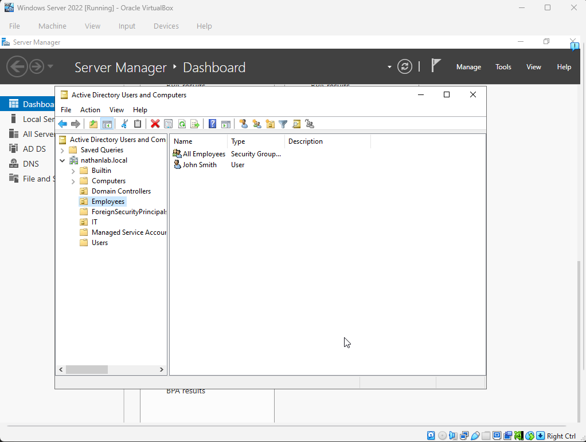
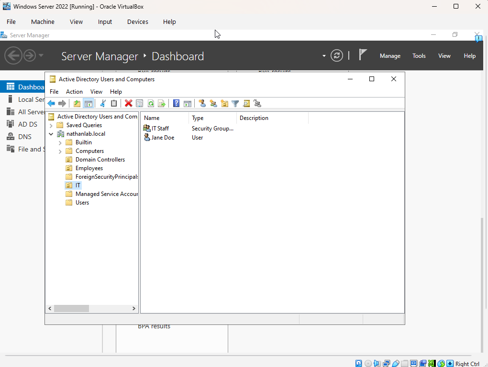
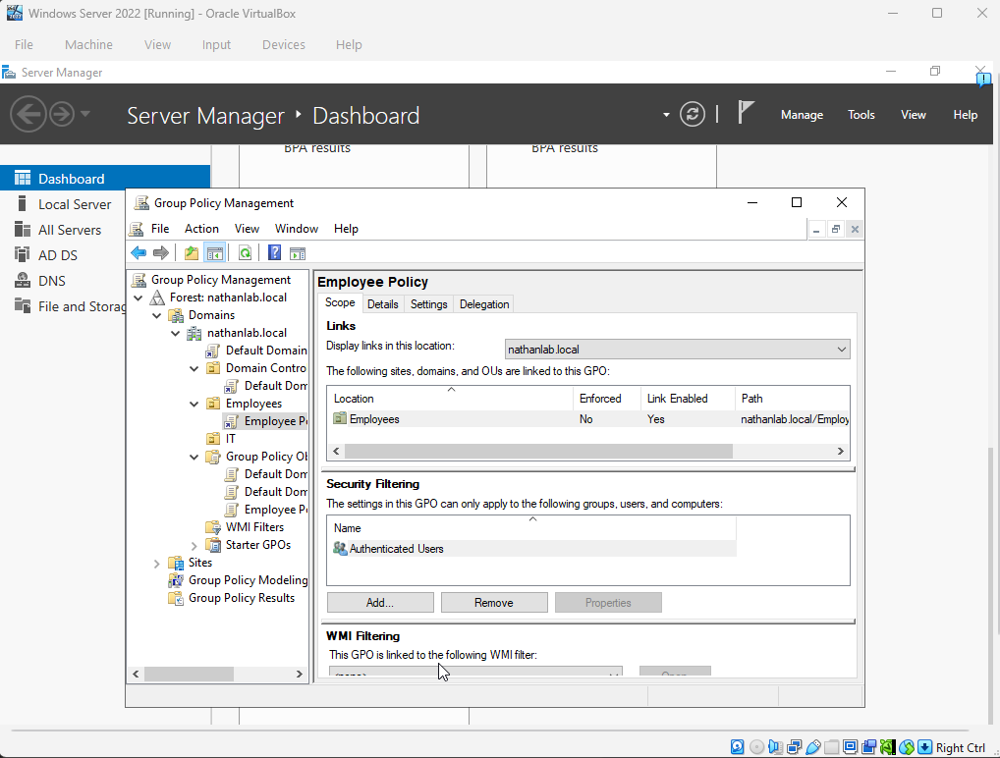
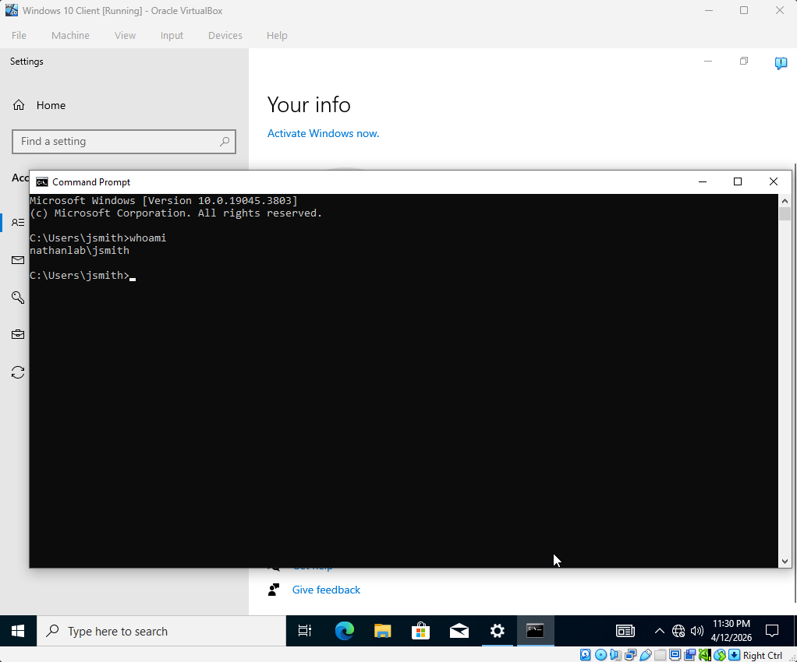
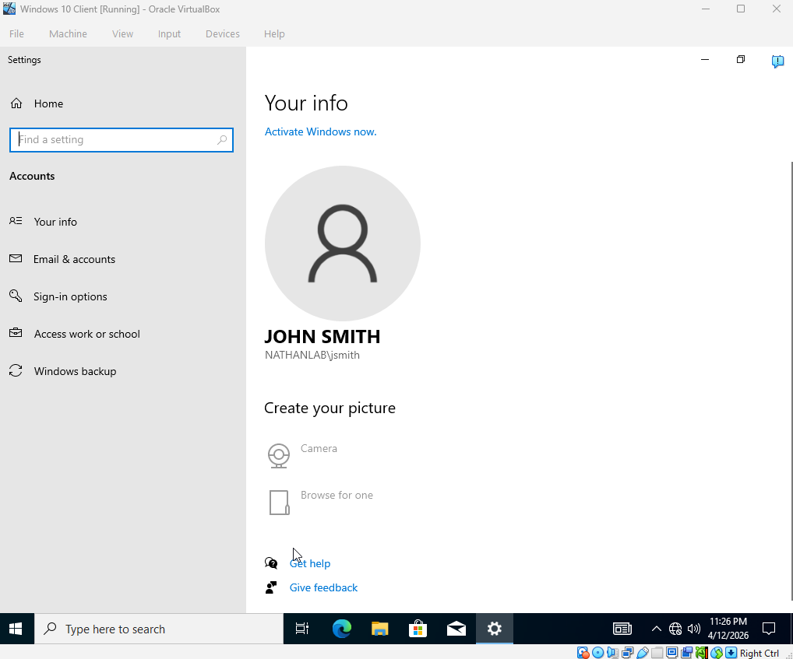
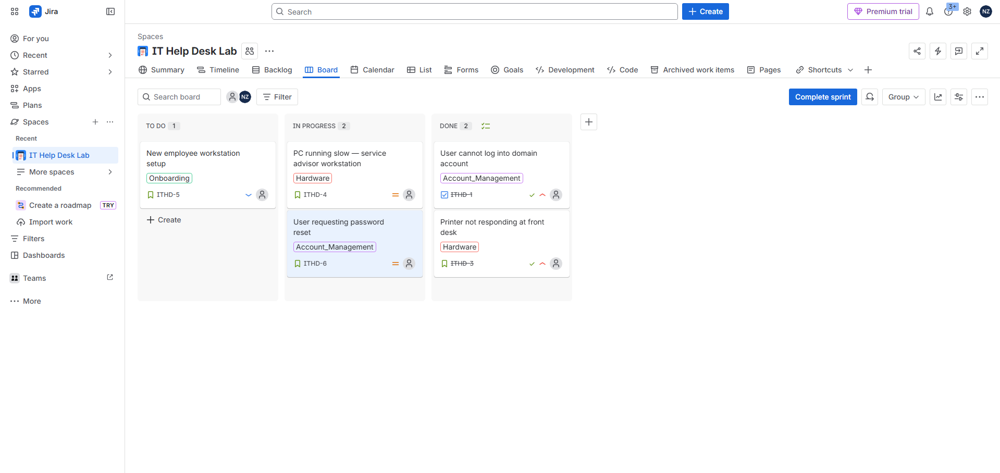
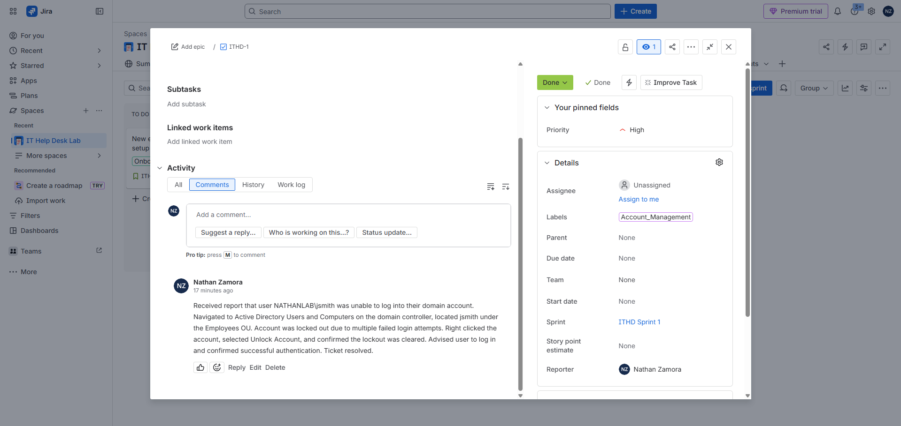
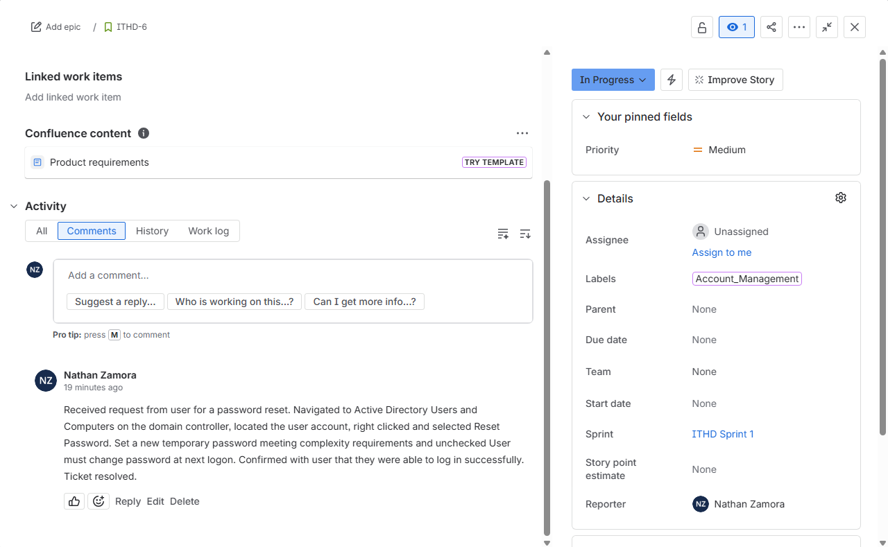

# Active Directory Home Lab

A virtualized home lab built to simulate a real enterprise IT environment using Windows Server 2022 and Active Directory. This project was built to develop hands-on experience with the tools and tasks common in IT support and systems administration roles.

## Environment

| Component | Details |
|---|---|
| Hypervisor | Oracle VirtualBox |
| Domain Controller | Windows Server 2022 Standard Evaluation |
| Client Machine | Windows 10 Pro |
| Domain | nathanlab.local |
| Network | Internal Network (192.168.1.0/24) |
| DC IP Address | 192.168.1.1 (static) |
| Client IP Address | 192.168.1.2 (static) |

## What Was Configured

**Active Directory Structure**
- Promoted Windows Server 2022 to a Domain Controller for nathanlab.local
- Created two Organizational Units: Employees and IT
- Created domain users: John Smith (jsmith) and Jane Doe (jdoe)
- Created security groups: All Employees and IT Staff
- Added users to their respective security groups

**Group Policy**
- Created Employee Policy GPO linked to the Employees OU
- Configured password policy: minimum 8 characters, complexity required, 90 day max age
- Configured account lockout policy: lockout after 5 invalid attempts

**Network Configuration**
- Assigned static IP to domain controller (192.168.1.1)
- Configured client machine with static IP (192.168.1.2)
- Set client DNS to point to domain controller for domain resolution
- Verified connectivity between VMs using ping

**Domain Join**
- Joined Windows 10 Pro client machine to nathanlab.local domain
- Logged in as domain user NATHANLAB\jsmith from the client machine
- Verified domain authentication using whoami command

## Help Desk Tasks Practiced
- User account creation and management in Active Directory
- Password resets for domain users
- Security group membership management
- Group Policy configuration and enforcement
- Domain join process for client machines
- Network troubleshooting between domain controller and client

## Screenshots

### Active Directory — Employees OU

### Active Directory — IT OU

### Group Policy — Employee Policy

### Domain User Login — whoami

### Domain User Account Info

## Help Desk Ticketing Lab

To complement the Active Directory environment, a Jira project was configured to simulate a real IT help desk ticket queue. Tickets were created, triaged, worked through, and resolved across a full sprint cycle.

### Ticket Scenarios

| Ticket | Category | Priority | Resolution |
|---|---|---|---|
| User cannot log into domain account | Account Management | High | Located account in AD, cleared lockout, confirmed login |
| Printer not responding at front desk | Hardware | High | Cleared print queue, restarted print spooler service |
| PC running slow — service advisor workstation | Hardware | Medium | Cleared startup programs, temp files, confirmed performance improvement |
| New employee workstation setup | Onboarding | Low | Created AD account, joined machine to domain, verified GPO applied |
| User requesting password reset | Account Management | Medium | Reset password in AD Users and Computers, confirmed successful login |

### What Was Practiced

- Creating and managing tickets in Jira across a full sprint
- Triaging tickets by priority and category
- Writing detailed resolution notes for each ticket
- Connecting help desk workflows to Active Directory tasks performed in the lab

### Screenshots

#### Completed Sprint Board

#### Sample Ticket — Account Lockout Resolution

#### Sample Ticket — Password Reset Resolution

## Tools Used
- Oracle VirtualBox
- Windows Server 2022
- Windows 10 Pro
- Active Directory Domain Services (AD DS)
- Group Policy Management Console
- DNS Server
- Jira (Atlassian)
- Scrum Sprint Workflow
